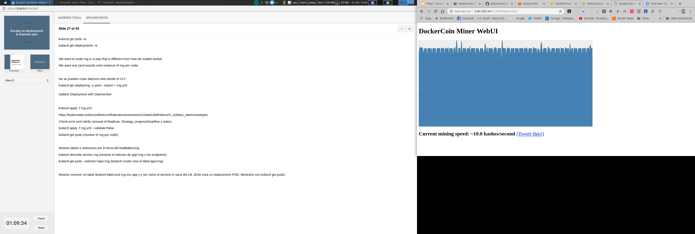
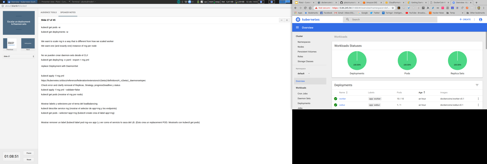
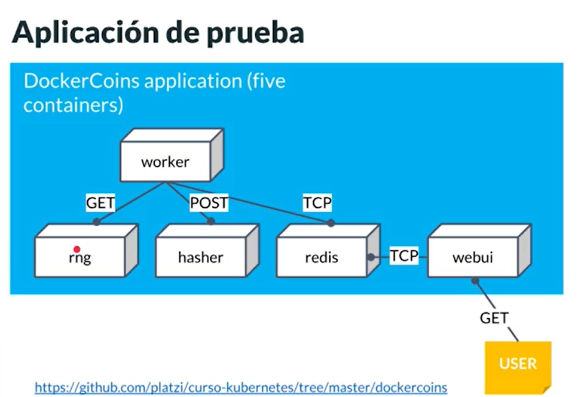

# Dockercoins

## Dockercoins is a trial application that you will use to maximize your Kubernetes learning. It is composed of different microservices written in multiple languages ​​such as Python, Nodejs and Ruby that communicate with each other to extract an artificial virtual currency. Implement the microservices in this application to implement all Kubernetes concepts.

## Dockercoins es una aplicación de prueba que utilizarás para maximizar el aprendizaje de Kubernetes. Está compuesta por diferentes microservicios escritos en múltiples lenguajes como Python, Nodejs y Ruby que se comunican entre sí con la finalidad de minar una moneda virtual artifical. Despliega los microservicios de esta aplicación para implementar todos los conceptos de Kubernetes.

### Iniciar proyecto
`cd dockercoins`
`docker-compose up`

### ejecomplo
kube multi_node
https://minikube.sigs.k8s.io/docs/tutorials/multi_node/
### escalar nodo
kubectl scale deploy/pingpong-deployment --replicas 8

### levantar dashboard
kubectl apply -f kubernetes-dashboard.yaml

